# Tarea 4.14. Visual Studio Code y Git

1. git add

    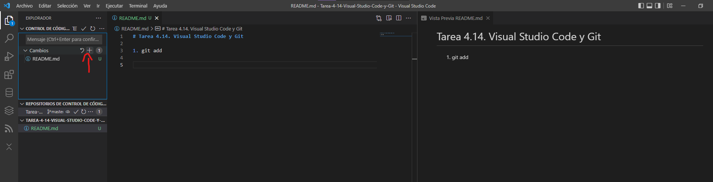
    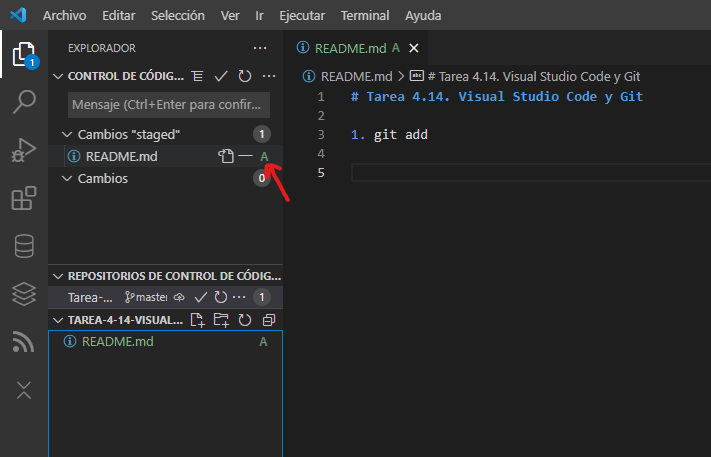

2. git commit cerrando un issue

    Creo el issue.
    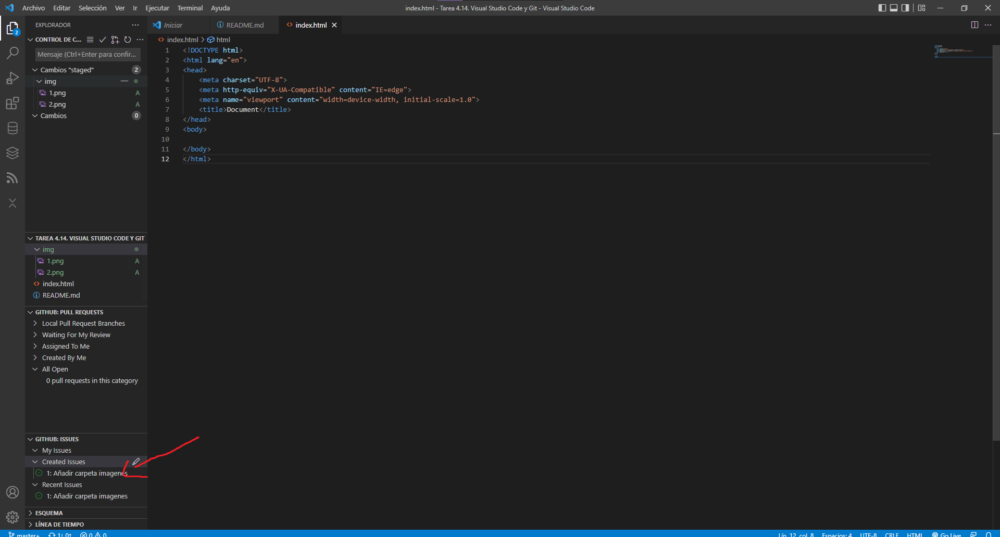

    Hago el cambio que necesita el issue con la palabra closes y a continuación el # con el codigo del issue 
    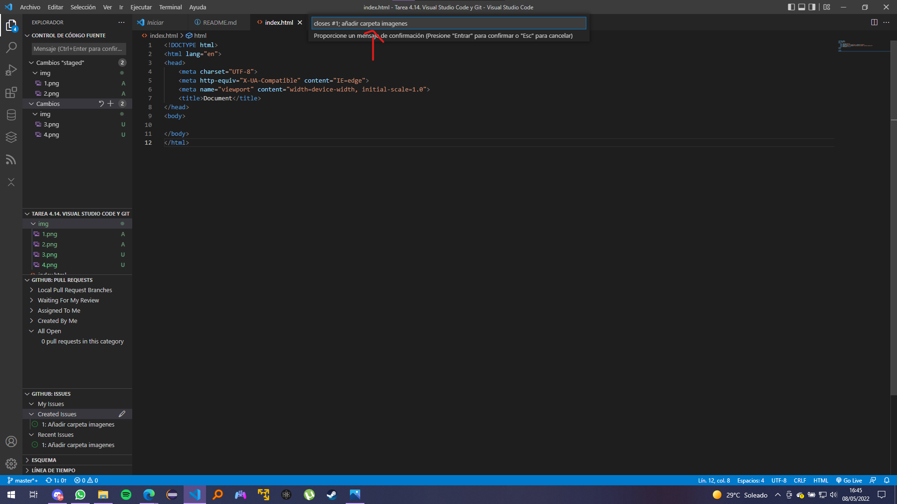

    En github podemos ver el issue cerrado con el comando
    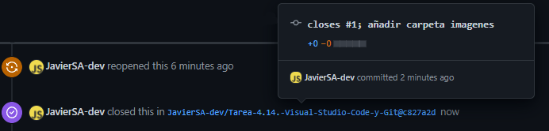

3. git push

    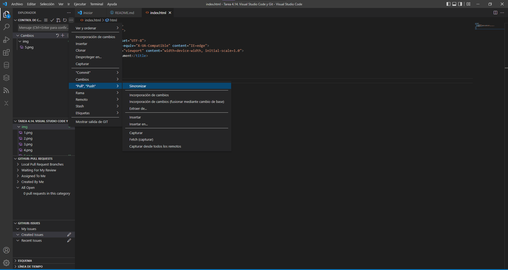

4. git checkout -b documentacion

    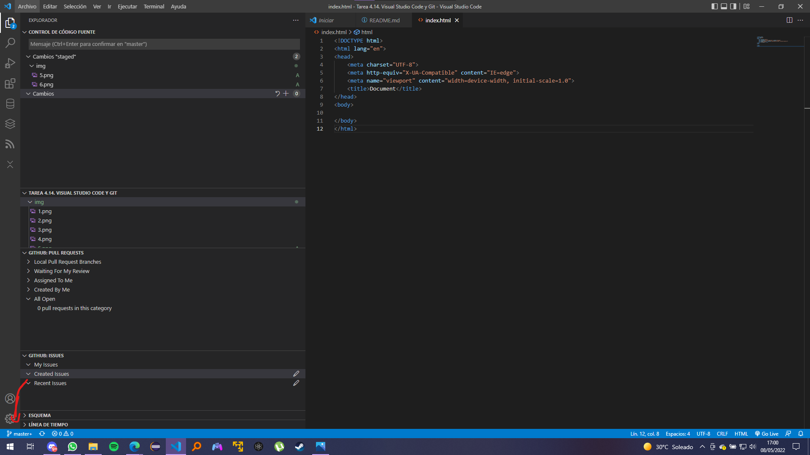
    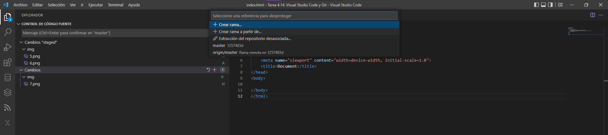
    Ponemos el nombre de la rama.
    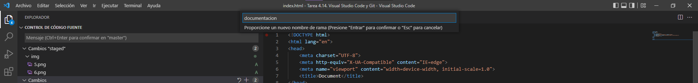
    Y visual studio ya cambia automaticamente a la rama nueva.
    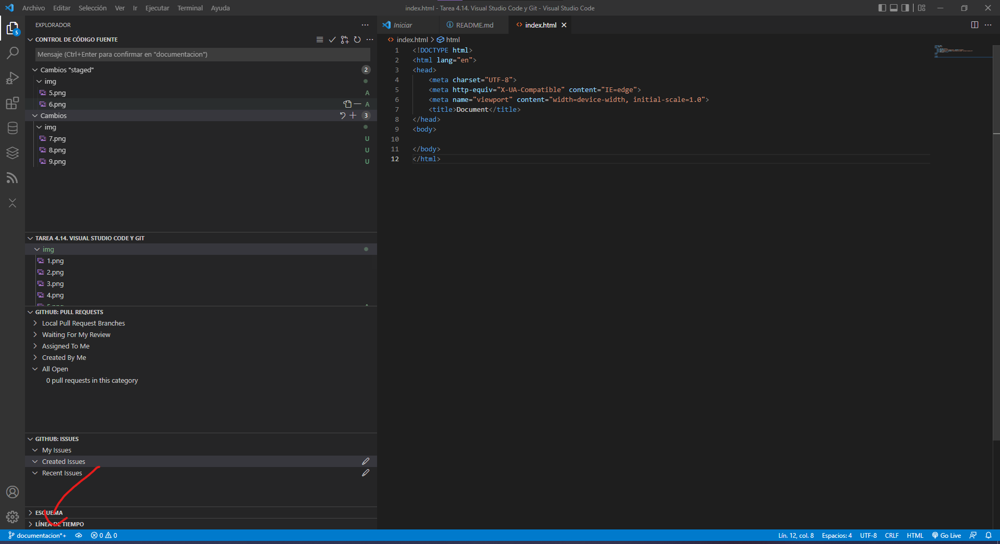

5. git merge 

    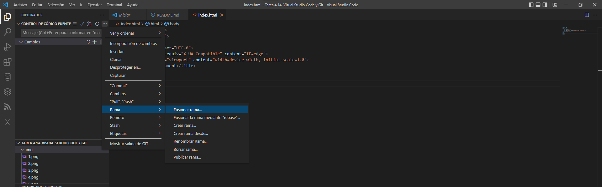

6. git diff

    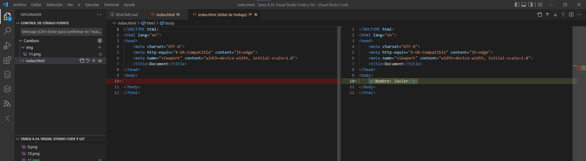

7. git push

    Realizas un cambio con commit y sincronizas los cambios, una vez añadido el remote.
    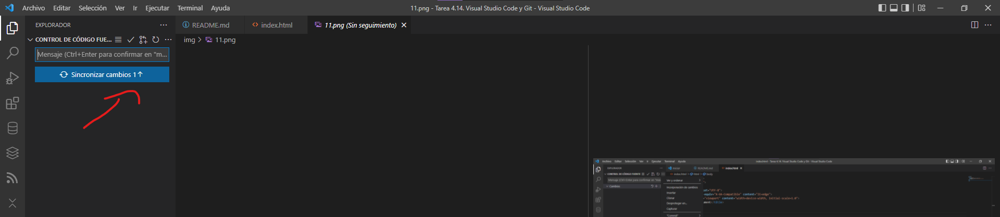

8. Colores del margen del editor: rojo, verde, azul